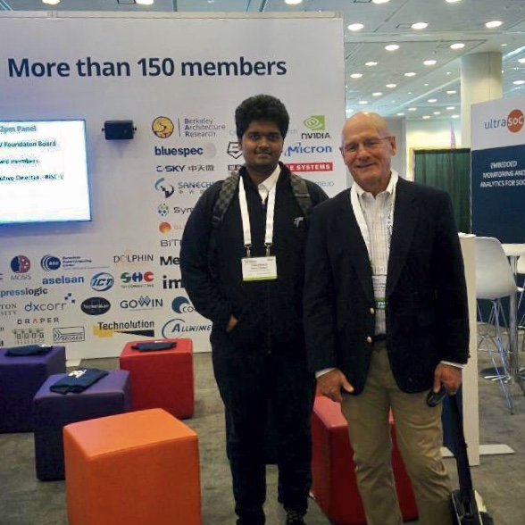

I'm a second year Doctoral student at IIT Madras, jointly advised by Prof. [V. Kamakoti](https://www.cse.iitm.ac.in/profile.php?arg=MTg=) and Prof. [Pratyush Kumar](http://www.cse.iitm.ac.in/~pratyush/) at IIT Madras and Prof. [Anand Raghunathan](https://engineering.purdue.edu/~araghu/) from Purdue University. 

My research interests broadly include specialized computer architectures. My current focus is on developing energy efficient hardware accelerators for Deep Learning Applications with a particular focus on exploiting sparsity and similarity in DNNs.

I am also primarily involved in the [SHAKTI processor program](http://shakti.org.in), where I developed the Floating Point Unit and the peripherals for a Micro-Controller class Processor (**C-Class Processors**) and was involved in almost all the facets of the chip-design stack right from RTL Design through Verification, FPGA Prototyping, Backend to Board bringup and post silicon validation. The design was **taped-out** in **Intel's 22nm FFL process** and **SCL's 180nm Process**. I am also driving the AI/ML accelerators development and Vector Processor development effort in the SHAKTI group. 

The SHAKTI C-Class codebase can be found [here](https://bitbucket.org/casl/c-class).
 
The Vector-Processor (in its initial phase) codebase can be found [here](https://bitbucket.org/casl/shakti_public/src/a07bfad52040965d667df5613b2a280b482d38e0/cores/common_modules/VectorAccel/?at=master).

# Achievements
* Received the [Richard Newton Young Student Fellow Award](https://dac.com/content/richard-newton-young-student-fellow-program-0) in the 55th Annual [Design Automation Conference](https://dac.com/), San Francisco, USA
* Received [SERB's Overseas Doctoral Fellowship award](http://www.serbonline.in/SERB/ovdf), 2018 to visit Purdue University as a visiting research scholar.
* The taped-out SHAKTI C-Class processor successfully powers on and boots linux oprating at 250-400 MHz
* Taped out the first completely Indigenously designed processor in India, codenamed RIMO which operates at around 70MHz in 180nm technology and can run embedded workloads.

# Talks
* Delivered a talk on the 22nm SHAKTI C-Class tapeout in RISC-V Workshop
  2018 representing the SHAKTI group, [Link](https://www.youtube.com/watch?v=eVn4tsOLRLg)

# SHAKTI in news
* [India Preps RISC-V processors, EETimes](https://www.eetimes.com/document.asp?doc_id=1328790&page_number=2)
* [An ARM Killer from IIT-Madras? Meet the brains behind India’s ambitious processor project, Factordaily](https://factordaily.com/india-chip-design-shakti-iit-madras/)
* [Linux Boots On “Shakti” — India’s First Ever RISC-V Based Silicon
  Processor, Fossbytes](https://fossbytes.com/linux-on-shakti-india-risc-v-processor-iitm/)
* [Linux boots on new “Shakti” RISC-V
  chip, Linuxgizmos](http://linuxgizmos.com/linux-boots-on-new-shakti-risc-v-chip/)
* [IIT-Madras powers up a desi
  chip, The Hindu](https://www.thehindu.com/sci-tech/technology/iit-madras-powers-up-a-desi-chip/article24609946.ece)
* [NDTV: IIT Madras Unveils India's First Indigenously-Developed Microprocessor](https://www.ndtv.com/india-news/iit-madras-unveils-indias-first-indigenously-developed-microprocessor-1938349) 

# SHAKTI in Social Media
* [Twitter](https://twitter.com/ShaktiProcessor/status/1022384131064430593)
* [Reddit](https://www.reddit.com/r/linux/comments/92tvqu/first_silicon_success_on_the_first_tapeout_linux/)
* [Hacker News](https://news.ycombinator.com/item?id=17642872&ref=hvper.com&utm_source=hvper.com&utm_medium=website)

